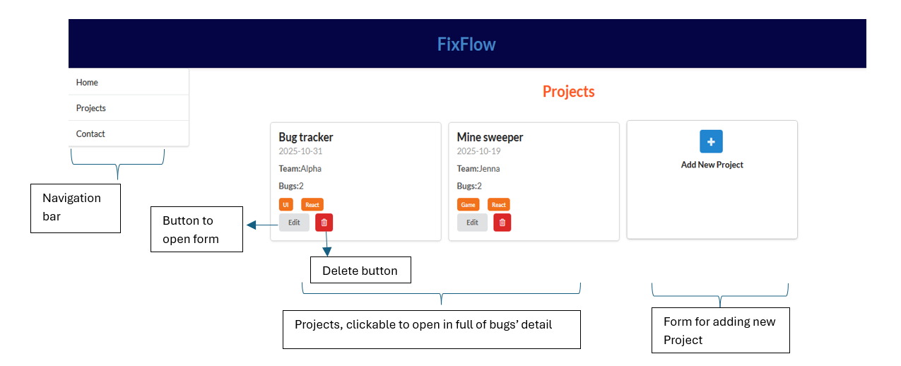
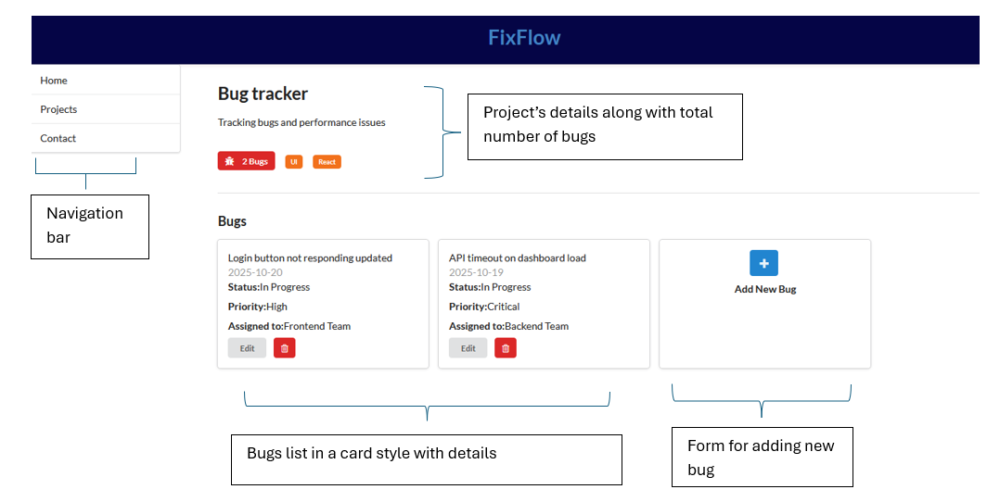
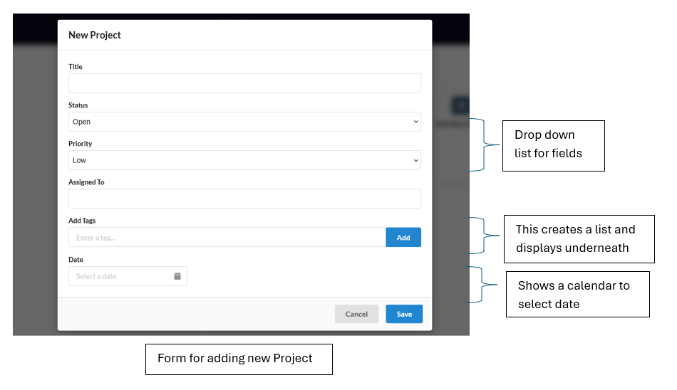
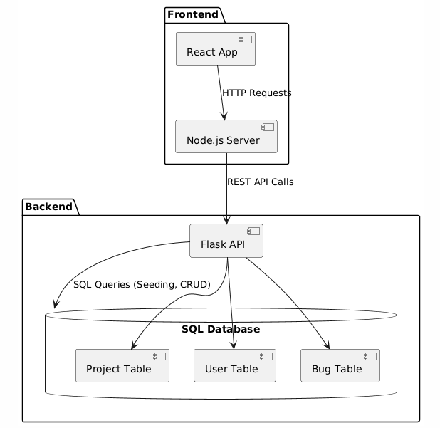

# FixFlow
A bug tracking application built to track bugs and represent with graphs developed with react and flask

## Frontend
Developed using React framework and implemented it using a function driven paradigm with react 18 which allows the web app's frontend to mount much quicker with respect to component/class driven applications, trading off some functionality for efficiency and cost economical and much faster.
### Routuing
Using browser side routing for quicker reponsive web app, it utilises routes and route with Links to naviagte the application
#### Pages 
Home : '/' Page loads all the projects in user's directory

Project Page: '/projects/PXXX' Displays all the bugs linked to the project

Project Form: Implented using React Modal dialog box for intutive user interface 

## Backend 
Developed using Flask framework, which allows for developing server side API for seeding data to the react app, and add new data

## UML diagram 

 
## Starting Application 
To start application its two part: Frontend (react) and backend (flask) 

React app:
Open CLI in frontend directory 
<pre><code>npm start</code></pre>

It starts the react scripts and launches Node.js server

Flask Server:
Open CLI in backend directory 
<pre><code>python -m flask run</code></pre>

This launches the the flask app and uses the env file for variables like name of app, Database routes. 